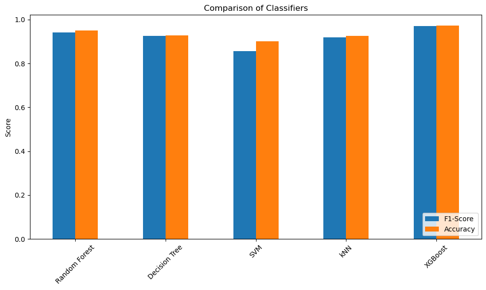
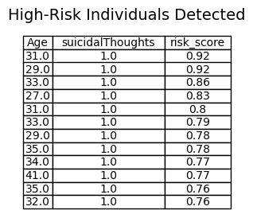

# Requerimentos:

```pip instal xgboost```
```pip instal scikit-learn```
```pip instal pandas```
```pip instal numpy```
```pip instal seaborn```
```pip instal matplotlib```

# A doença fantasma: Detectando possíveis casos de depressão não diagnosticados
Autor: Gustavo L. Matos

## Introdução

A luta contra depressão é extremamente séria, com taxas que aumentam no último século. Se nota que em adolescentes, as taxas podem chegar a até 1 em 5 indivíduos[1]. Com isso, vem-se alta demanda de psiquiatras e psicólogos. Devido a limitações de sistemas de saúde, possíveis preconceitos e falta de conhecimento sobre saúde mental, casos de depressão podem passar despercebidos[2]. A intenção desse trabalho é desenvolver um algorítmo que detecta, usando outras informações, indivíduos que estão em risco de depressão ou que podem possuir depressão para que possam ser alertados a buscar um psiquiatra para fins diagnósticos. 

## Dados utilizados:

Os dados foram obtidos por meio da plataforma Kaggle. Esse arquivo consiste de uma versão alterada[3] dos dados de uma pesquisa anônima[], coletada em várias cidades, contendo participantes de 18 a 60 anos[4]. As colunas numéricas indicam idade, pressão que sente no trabalho (de 1 a 5), satisfação com o emprego (de 1 a 5), horas trabalhadas, stress financeiro (de 1 a 5). Já as colunas categóricas indicam gênero, duração do sono, hábitos de dieta, se já houveram ou não pensamentos suicídas, histórico familiar, e se está ou não diagnosticado com um presente quadro de depressão.

## Metodologia

Os dados foram tratados e transformados para mais simples utilização nos propósitos do projeto. Variáveis categóricas foram transformadas em colunas binárias para cada classe identificada; Também foi criada uma nova coluna organizando as quatro categorias presentes que se referiam a tempo de sono numa escala de 1 a 4. Devido ao objetivo de detecção de falsos negativos e a esparcidade dos casos positivos, foi criado um novo banco de dados utilizando os dados originais, mas de forma a possuir a mesma quantidade de casos positivos e negativos. Os casos negativos inclusos foram extraídos como amostra aleatória entre as colunas do banco de dados original.

Após isso, foram testados vários modelos, separando o dataset original em treino e teste, para avaliar a perfomance. Os modelos testados foram os classificadores Random Forest, Decision Tree, SVC, KNeighbors[5] e XGBC[6]. Entre esses, o modelo XGBC teve a melhor desempenho em métricas F1 e accuracy[7]; Entretanto, o modelo RandomForest foi escolhido pela diferença seu desempenho com a do melhor modelo ser na ordem de 10^{-3}, e por possuir mais simplicidade de entendimento a parametrização e customização do modelo. O modelo escolhido foi então treinado nos dados balanceados, e a previsão de probabilidade foi feita em valores do banco de dados original. Indivíduos que tiveram probabilidade de depressão acima de 75% foram considerados em risco.



## Resultados


O modelo final escolhido teve accuracy de 92% e f1-score de 0.93 ao estimar o caso positivo. Os indivíduos em risco tinham idades ente 27 e 41, e o indivíduo com maior probabilidade estimada tinha 31 anos, e foi estimado a ter 92% de chance de depressão.




## Discussão e conclusão

A alta accuracy do modelo indica a viabilidade do estudo, que benefíciaria de mais ampla investigação. Com mais dados e testes mais rigorosos, os modelos podem ser aplicados de modo a beneficiar a vida de pacientes que, em outras circunstâncias, possivelmente não teriam conhecimento de quando ir ao médico quanto a saúde mental.  


[1] https://pmc.ncbi.nlm.nih.gov/articles/PMC9483000/
[2] https://pmc.ncbi.nlm.nih.gov/articles/PMC9470500/
[3] https://www.kaggle.com/datasets/ikynahidwin/depression-professional-dataset/data
[4] https://www.kaggle.com/datasets/sumansharmadataworld/depression-surveydataset-for-analysis
[5] https://scikit-learn.org/0.21/documentation.html
[6] https://xgboost.readthedocs.io/en/stable/index.html
[7] https://link.springer.com/chapter/10.1007/978-3-031-35314-7_2